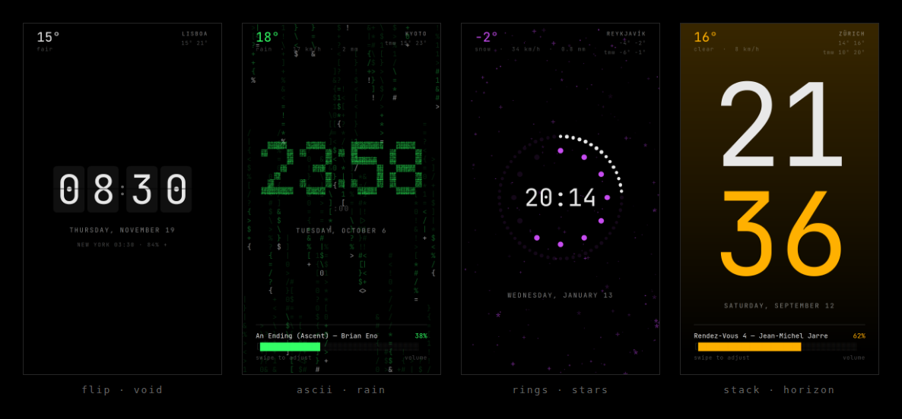
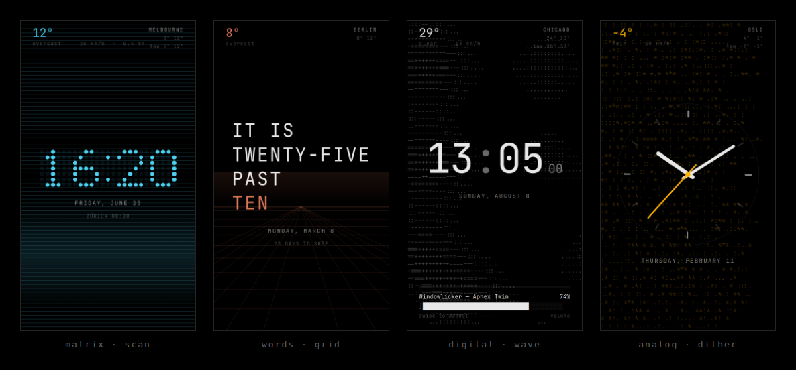
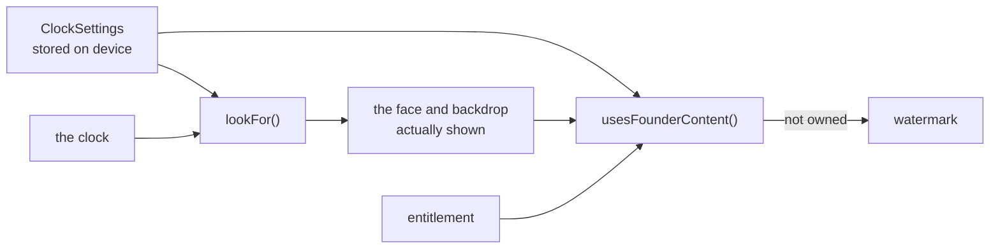
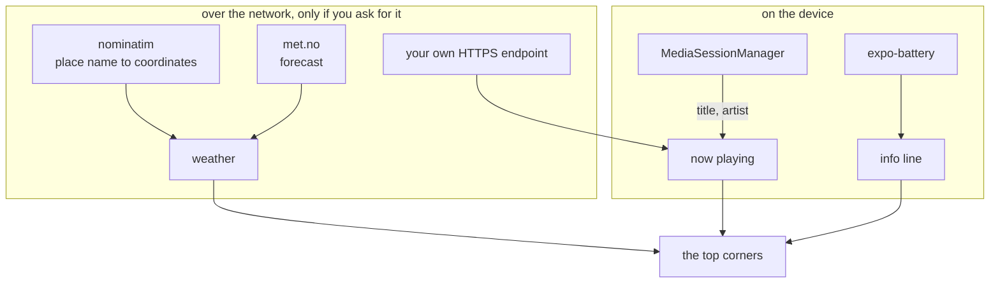

<div align="center">


# Kiosk

**A full-screen clock for a phone you leave switched on.**
Eight faces, eight backdrops, one ink colour at a time — drawn with characters
and rules, in the idiom of a phosphor terminal.

<sub>
Expo SDK 57 · React Native 0.86 · TypeScript (strict) · Android · iOS · Web
</sub>

</div>



---

## What it is

A clock for a device that has stopped being a phone: propped on a desk, docked
by a bed, hung on a wall. Not a widget, not a lock screen — the whole display,
black, with the time on it and nothing you did not ask for.

It shows the weather where you tell it, what is playing on the device, and a
volume bar you drag sideways. It dims itself at night on your hours, drifts a
few pixels an hour so it will not burn into an OLED panel, and keeps the screen
awake while it is up.

No account. No server. No analytics. Nothing leaves the device except the two
weather requests you asked for by typing a place name.

---

## Install

**On a phone, from a release** — download `kiosk-clock.apk` from
[Releases](../../releases), open it, allow installs from unknown sources.
Or build one yourself: run the **Android** workflow from the Actions tab and
take `kiosk-apk` from the finished run. No Expo account, no Android Studio, no
local JDK — GitHub's runners already carry the Android SDK.

**On a computer** — `npm install && npm run web`, then F11. Web is a checked
target, not an afterthought: it is exported and verified alongside iOS and
Android, and it is the quickest way to put the clock on a spare monitor.

**Over Expo Go** — `npm start` and scan the QR code. Every dependency is an
Expo SDK module, so nothing compiles locally. The one exception is the
now-playing device source, which is a native module and needs a real build.

---



## What it does

### Eight faces

| | |
|---|---|
| **digital** | plain, and the default |
| **ascii** | the time as character art — roughly 2,500 small glyphs arranged into the digits |
| **stack** | hours over minutes, readable across a room |
| **analog** | a minimal dial |
| **words** | "it is twenty-five past three" |
| **flip** | a split-flap board. The whole effect is the seam |
| **matrix** | the same 5×7 glyph table as ascii, rendered as lit and unlit lamps |
| **rings** | concentric dot dials — the time as a shape before it is a number |

Each is one component that scales from a single `size` prop, so the settings
picker previews the real face rather than a drawing of it.

### Eight backdrops

`void` is plain black. Five read a single continuous daylight value — 0 at
midnight, 1 at midday, on a cosine — so they drift rather than switch:
`horizon` brightens overhead through the day, `stars` thicken after dark,
`dither` fills its character field toward noon, `grid` is a ground plane
running to a vanishing point, and `scan` is a CRT under a bright roll that
takes seven seconds to cross.

`wave` is a drifting field of 2D Perlin noise rendered as characters, with its
own speed and frequency. `rain` shares that speed: falling glyph columns, drawn
in three depth passes rather than one text node per character.

> **None of them is allowed to become the subject.** Each is measured against a
> plain-black render — peak and mean luminance, and the share of pixels it
> touches — and tuned to sit in the same band as the others. That is how the
> grid got halved and the scanlines got doubled.

### One ink colour

White, amber and green — the phosphors — a warm accent, and a fifth you mix
yourself off a hue rail. Only the hue is yours: saturation and lightness are
fixed where the built-in phosphors sit, so every choice lands as legible as
they are. A free HSL picker would let someone choose 8% lightness and conclude
the app was broken.

Colour carries no meaning anywhere else in the interface. State is shown with
brackets, rules and inverse video, so nothing has to be decoded.

### And

**Weather** in the top corners for anywhere you name, with wind, rain and
tomorrow. **Now playing** read from the device's own media session, or from an
HTTPS endpoint you point it at. **A volume bar** you drag sideways — relative,
not absolute, so a stray tap cannot slam the level. **Shuffle**, a new look
every quarter hour, hour or day. **Presets** — name a look and come back to it.
And a line under the date carrying a second time zone, a countdown and the
battery.

---

## How it fits together

The look on screen is *derived*, never stored. Shuffle is a lens over your
settings rather than a writer of them, so turning it off returns you to exactly
the clock you set up:



Data comes from at most three places, all optional, none of them the
developer's:



`MediaSessionManager` needs Notification Access. The service that holds that
grant **overrides no callbacks** — no notification is ever delivered to it, let
alone read. It exists to be enabled, because holding the grant is what makes
`getActiveSessions()` callable.

---

## Layout

```
app/                    Routes only — thin wrappers around screens
  _layout.tsx           Providers + stack (settings and founder are modals)
  index.tsx             Kiosk
  settings.tsx          Settings
  founder.tsx           What the pack unlocks, and buying it

src/
  design/               Tokens and the monochrome palette
  core/                 useNow, daylight, formatting, storage port,
                        seeded noise, 2D Perlin, useDebounced
  clock/
    settings.ts         Domain: ClockSettings, defaults, decode
    SettingsContext.tsx State + debounced persistence
    faces/              One component per face, the 5x7 glyph table,
                        and the registry
    Backdrop.tsx        The seven drawn backdrops
    shuffle.ts          The shown look, derived from settings + the clock
    extras.ts           Second clock, countdown and battery line — all pure
    presets.ts          Saved looks, validated back through decodeSettings
    InfoLine.tsx        The row those three share, under the date
    KioskScreen.tsx     Composition
  media/                Now playing, system volume, the audio bar
  weather/              Domain, the two services, the corner readouts
  billing/              What is for sale, the store port, the watermark
  power/useBattery.ts   Guarded adapter over expo-battery
  ui/                   Headings, checks, choices, fields, steppers, hue rail

modules/now-playing/    Local Android module: a NotificationListenerService
                        that holds the grant, and MediaSessionManager reads

plugins/                Release signing, injected into the generated project
scripts/                Native-version and merged-manifest guards
docs/                   Launch plan, Play requirements, privacy, data safety
store/                  Listing images and copy
```

Dependencies point inward: `ui` and screens depend on `core` and `design`,
never the reverse, and nothing outside `core/storage.ts` knows AsyncStorage
exists.

### Conventions

- Adding a face means adding one entry to `src/clock/faces/index.ts`. That
  entry declares the face's own proportions, because faces differ enormously
  and the screen sizes each from the box it measured.
- Shuffle is derived, never persisted. Anything that rotates what is shown
  reads through `lookFor` rather than writing to `settings`.
- What the founder pack gates lives in `src/billing/catalog.ts` and nowhere
  else.
- Every decoder over a third-party payload is total: it takes `unknown`,
  returns null on anything it does not recognise, and never throws.
- No `Intl`. Dates, times and the world clock are formatted by hand so output
  is identical on every engine.
- Day arithmetic collapses both ends to local midnight and rounds — a day
  crossing a daylight-saving boundary is 23 or 25 hours long.
- No hardcoded colours outside `src/design/palette.ts`.

---

## Privacy and security

- **Two permissions.** `INTERNET` and `VIBRATE`. Expo's template ships
  `SYSTEM_ALERT_WINDOW` and both storage permissions under a comment reading
  "remove whatever you do not need"; they are stripped in `app.json`, and CI
  fails the build if the **merged** manifest ever grows a third.
- **Backups are off.** Settings and presets are not copied to Google Drive.
- **Nothing is evaluated.** No `eval`, no `dangerouslySetInnerHTML`, no
  WebView, and OTA updates are disabled — there is no channel through which
  code could arrive after install.
- **No secrets ship.** Both weather services are keyless, which is most of why
  they were chosen: a key inside an APK is a key anyone can read back out.
- **The configured endpoint is untrusted input**, even though you typed it.
  HTTPS only, body refused over 64 KB before parsing, fields truncated.

Full detail — including the two known and documented risks, what each weather
service receives, and how now-playing resolves on each platform — is in
[`docs/platform-notes.md`](docs/platform-notes.md).

---

## Development

```bash
npm install
npm run web          # the fastest loop
npm run typecheck
npm run bundle       # the real Metro bundler, all three platforms
npm run check:native # native packages against the SDK pins
```

Before pushing, run `typecheck` and `bundle` — the latter catches resolution
errors that typechecking misses. CI runs both, plus a merged-manifest check,
on every build.

Weather and now-playing are verified against intercepted requests rather than
live ones, and the visual work is measured rather than eyeballed: backdrops
against a plain-black control, the night dim against an otherwise identical
frame, custom hues for legibility across all 360 degrees.

---

<div align="center">
<sub>

Forecast by the [Norwegian Meteorological Institute](https://api.met.no/) ·
places by [Nominatim](https://nominatim.openstreetmap.org/) · both CC BY 4.0

</sub>
</div>
