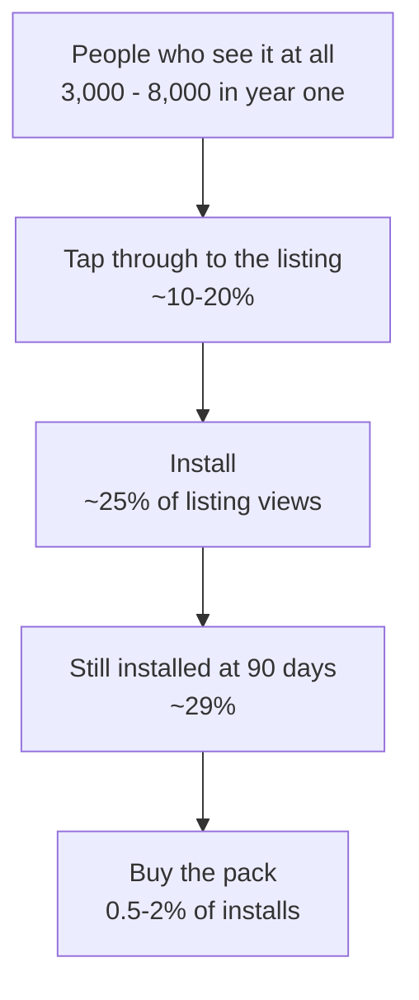

# Market plan

Written pessimistically, on request. Where a number is a guess it says so, and
where evidence exists it is cited. The intent is not discouragement — it is
that you should decide what to spend on this with the real distribution in
front of you rather than the survivorship-biased one.

---

## The one-paragraph version

A first app, from an unknown developer, in the most saturated utility category
on the store, with a deliberately niche aesthetic and no viral loop, launching
against roughly **2,400 new apps a day**. The pessimistic year-one outcome is
**200–800 installs and under €50 of revenue**. The realistic-with-effort
outcome is **1,000–3,000 installs**. A single post landing well on the right
community is the difference, and that is a coin flip you get to re-flip a few
times. Plan for the app to cost you €25 and a lot of evenings, and to be worth
having built for reasons other than money.

---

## Why this is hard, specifically

Not generic pessimism. These are properties of *this* app:

1. **"Clock" is saturated to the point of being unrankable.** The top results
   have tens of millions of installs and years of ranking signal. A listing
   with zero installs ranks for nothing competitive. You will only ever be
   found on long-tail terms — "terminal clock", "monospace clock",
   "fullscreen kiosk clock" — which have search volume in the tens per month,
   worldwide.
2. **The aesthetic is the product, and it is niche on purpose.** Monochrome
   character art is a strong filter. That is good for finding a small devoted
   audience and bad for everything else. Most people who see it will not want
   it, and that is by design.
3. **No viral loop.** Nobody shares a clock. There is no invite, no multiplayer,
   no content to post. Every install is bought with attention you spent once.
4. **No content surface.** You cannot blog weekly about a clock. There is no
   stream of updates anyone outside the project cares about.
5. **Zero social proof at launch.** No reviews, no installs, no brand. Play's
   ranking and the human deciding whether to tap both key off signals you will
   not have for months.
6. **The name.** "Kiosk" on Play means employee time-clocks and device lockdown.
   You are competing for a word that already points somewhere else.
7. **Revenue is one cosmetic unlock.** No subscription, no recurring anything.
   The ceiling is *installs × a low single-digit percentage × one price*.

## What is genuinely in its favour

Stated plainly, without cheerleading:

- **The niche is identifiable and reachable.** r/unixporn, r/androidapps,
  terminal-aesthetic and dashboard communities. These are places where this
  specific thing is the thing they like. Most apps do not have a room like that.
- **Open source, no tracking, no account.** That is a real credibility asset in
  exactly those rooms, and it unlocks F-Droid, which most commercial apps
  cannot use.
- **Zero running cost.** No server, no API bills. It can sit on the store for
  five years accruing a trickle without burning anything. Most failed apps have
  to be switched off; this one does not.
- **Genuine stickiness if it survives week one.** A clock left running on a dock
  does not get uninstalled. The problem is week one, not month six.
- **The repository is itself a channel.** Developers find things on GitHub, and
  a well-built public repo converts to credibility better than a store listing.

---

## The funnel, pessimistically

Each step is where the honest loss happens. The top number is the one you
control, and it is small because it is bought one post at a time.

## Year-one install estimates

| | Installs | What has to happen |
|---|---|---|
| **Pessimistic** | **200–800** | You launch, post two or three times, posts land averagely, then it sits. This is the modal outcome. |
| Base, with sustained effort | 1,000–3,000 | Six to ten posts across the year, one of them does well, F-Droid listing, some GitHub traction. |
| Good | 5,000–15,000 | One post genuinely lands — front page of a large subreddit or Hacker News — and the listing converts. |
| Outlier | 50,000+ | An Android news site picks it up. Not plannable. |

Grounding: an indie developer's documented first month was **63 downloads**,
about two or three a day. **71% of app users churn within 90 days.** Roughly
**2,442 new apps are published to Play every day**, which is the denominator
your listing is competing inside.

## Year-one revenue estimates

Assuming the Founder pack ships at about €4.99, and Play's 15% cut on the
first $1M.

| | Installs | Conversion | Gross | Net |
|---|---|---|---|---|
| **Pessimistic** | 400 | 0.5% | **~€10** | **~€8** |
| Base | 2,000 | 1.5% | ~€150 | ~€127 |
| Good | 10,000 | 2% | ~€1,000 | ~€850 |

Against a €25 account fee. **The pessimistic case does not clear the account
fee in year one.**

Two things make this worse than the table looks. First, on the recommended
plan v1 ships **free**, so most of year one has no revenue at all by design.
Second, cosmetic unlocks in free utilities convert at the low end — 0.5–2% is
generous for an app with no reviews. RevenueCat's 2026 figures put the
**median** app under **$50/month after twelve months**, with only 17.2%
reaching $1,000/month; those are subscription apps, which monetise better than
one-time unlocks.

---

## Channels, with expected yield

Ordered by fit, not by size. Yields are year-one and pessimistic.

| Channel | Effort | Fit | Pessimistic yield |
|---|---|---|---|
| **r/unixporn** | one post, done well | **best fit you have** — the terminal aesthetic *is* that community | 20–200 |
| **F-Droid** | one-time packaging | excellent — open source, no tracking, no account | 50–300, and durable |
| **Play organic search** | passive | poor at first, compounds slowly | 50–300 |
| **GitHub / awesome-lists** | ongoing, low | good — developers are your people | 20–100 |
| **Hacker News (Show HN)** | one post | bimodal: most sink without trace | 0–500 |
| **r/androidapps** | one post | moderate — the audience is right, the volume is not | 5–50 |
| **XDA and Android forums** | one or two posts | moderate, slow, durable | 10–50 |
| **Product Hunt** | one launch | weak for Android utilities | 10–100 |
| **Paid ads** | money | **do not** — CPI would exceed lifetime value by an order of magnitude | — |

Reddit converts poorly to installs specifically — readers are browsing, not
shopping. A useful calibration from people who track it: **~50 upvotes buys
about 5–10 visits** to a linked product. Judge Reddit on feedback quality, not
on a download spike, and expect to spend **two to six weeks participating
genuinely** in a community before posting your own thing in it.

---

## A twelve-month plan

**Months 0–2 — get live.** Follow `launch-plan.md`. Do not market anything
during closed testing; twelve testers is a compliance gate, not an audience.
Free v1, no purchase.

**Month 3 — the one good shot.** Post to **r/unixporn** first, because it is
the best fit and you only get one first impression per community. Lead with the
hero image, not the store link. Have the GitHub repo ready — that audience will
look. Then **r/androidapps** a week later, then **Show HN** a week after that,
each with a different angle: aesthetic, then utility, then engineering.

Expect: 50–300 installs across all three. Expect one of them to get four
comments and vanish.

**Months 4–5 — F-Droid.** Package and submit. Slower and more bureaucratic than
Play, but it puts you in front of exactly the people who care that this has no
tracking, and it keeps paying out for years.

**Month 6 — the honest checkpoint.** See kill criteria below.

**Months 6–12 — only if the checkpoint passes.** Ship the founder pack and the
device media-session feature. Now you have reviews, ranking signal and an
audience that exists. Post an update to the same communities with something
genuinely new to show — a new face lands better than a changelog.

---

## Kill criteria

Decide these now, while it is cheap to be honest:

- **Under 200 installs at six months** with the three posts made: organic
  discovery is not going to happen for this listing. Stop spending evenings on
  marketing. Keep it published — it costs nothing.
- **Under 500 installs at twelve months**: do not build the paid tier. There is
  no audience to sell to, and the watermark will only annoy the few people who
  do use it.
- **Over 2,000 installs and a 4.5+ rating at six months**: this is working
  better than the base case. Ship the pack, and consider that the aesthetic
  clock niche may be worth a second app.

## What would have to be true for this to go well

Not predictions — conditions. If none of them look plausible to you, that is
useful information:

1. One post lands on a large, well-matched community. This is mostly luck, and
   the way to buy more of it is more shots, spaced out, in the right rooms.
2. The listing converts. Your screenshots are strong and unusual, which is the
   one lever you have already pulled properly.
3. Someone with an audience finds it and writes about it. Unplannable, more
   likely because the repo is public and good.
4. You keep shipping for a year without revenue. This is the real cost, and it
   is the one that usually ends projects like this.

---

## The honest bottom line

Build this because the artefact is worth having built, because it is good, and
because it will run on your own desk for years. Treat any revenue as a
surprise. The pessimistic case — **a few hundred installs, under €50, and a
portfolio piece that demonstrably works** — is the outcome to plan around, and
it is not a failure. It is what shipping a first app usually looks like.
